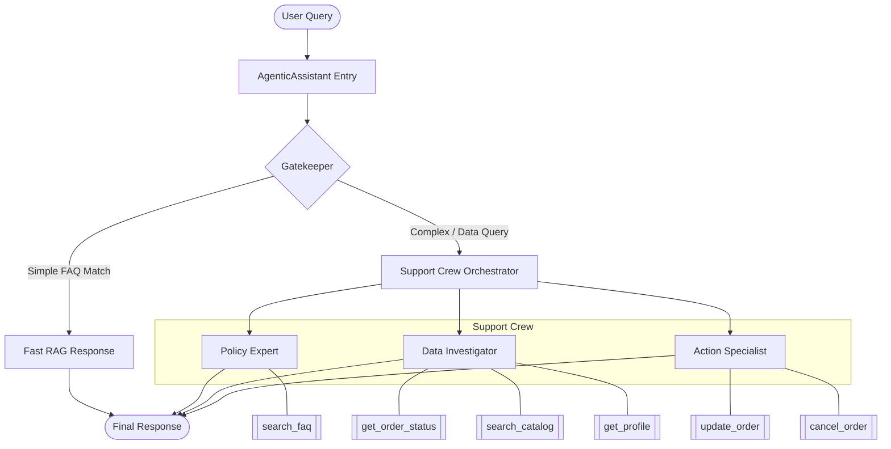

# AI Customer Support: Agents & Tools Map

This document outlines the hybrid agentic architecture designed to balance lightning-fast FAQ responses with sophisticated multi-agent reasoning and database operations.

## Architecture Diagram

## Agent Roles & Permissions

| Agent | Responsibility | Access Level | Key Tools |
| :--- | :--- | :--- | :--- |
| **Gatekeeper** | Tier 1 Filter. Answers obvious FAQs in < 3s using direct RAG. | Read-Only | Fast RAG Check / Evaluator LLM |
| **Policy Expert** | Handles policy nuances (returns, shipping, edge cases). | Read-Only | `search_faq` |
| **Data Investigator** | Finds orders, customer data, and product availability from SQLite. | **Read-Only** | `get_order_status`, `search_catalog`, `get_customer_info` |
| **Action Specialist** | Performs modifications such as updating addresses or cancelling orders. | **Read/Write** | `update_order`, `cancel_order` (Planned) |

## Implementation Strategy

1. **Heuristic Routing:** The Gatekeeper uses a mix of regex intent matching and a "Low-Temperature" LLM check to decide if a query can be solved by FAQ alone.
2. **Specialized Tooling:** Agents are restricted to their specific toolsets to prevent "tool hallucination" and unauthorized data access.
3. **Escalation Path:** Any query that fails the "Fast RAG" check or requires data beyond static policies is automatically escalated to the **Support Crew**.
