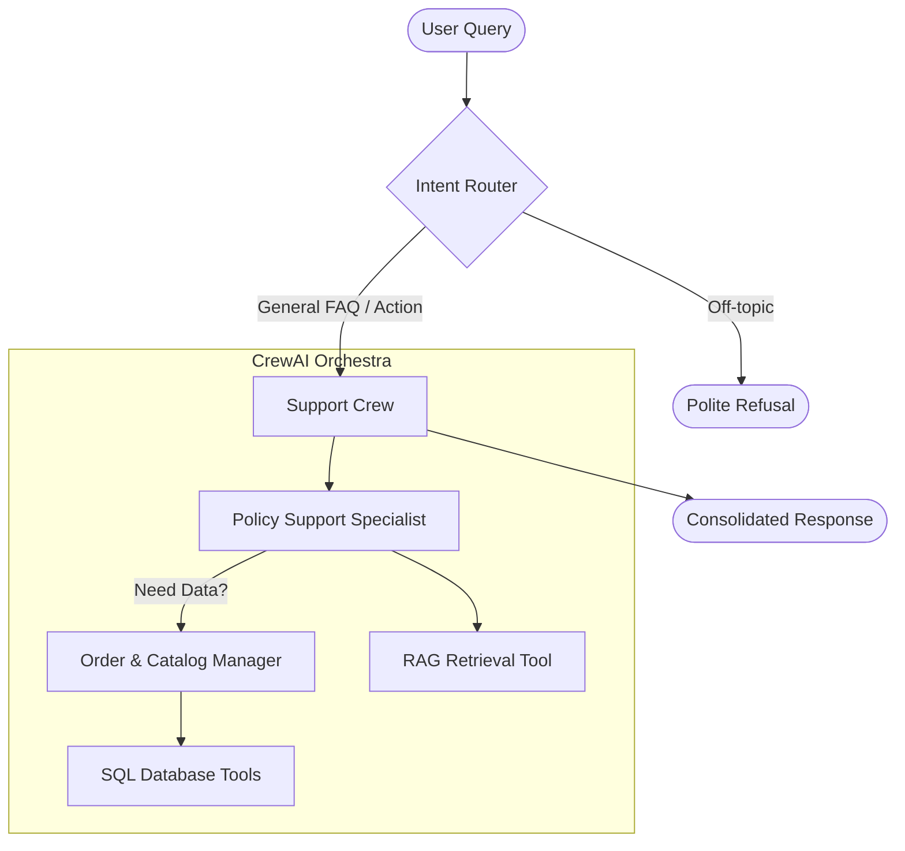

# Architecture: Multi-Agent CrewAI System

This document defines the high-level architecture for the local customer support system, utilizing the **CrewAI** multi-agent framework for collaborative problem-solving.

## 1. The Multi-Agent Collaboration Loop
The system has transitioned from a single RAG chain to a hierarchical team of specialized agents. This allows for better role-playing, more robust tool usage, and intelligent task delegation.

1.  **Intent Router**: Initially classifies the query into `FAQ`, `ACTION`, or `OUT_OF_SCOPE`.
2.  **The Crew**: A team of agents supervised by a sequential process:
    - **Policy Support Specialist**: First responder. Analyzes the query using the FAQ knowledge base (RAG).
    - **Order & Catalog Manager**: Data expert. Fetches live order, user, and product data if required.
3.  **Synthesis**: The final agent consolidates policy and data findings into a single, professional response.

## 2. Component Interaction

## 3. Local Constraints
*   **Framework**: CrewAI 1.14+ (orchestrated with Llama 3.1:8b).
*   **LLM Integration**: Native CrewAI `LLM` wrapper pointing to local Ollama (`http://localhost:11434`).
*   **Persistence**: ChromaDB for FAQs and SQLite for transactional data.
