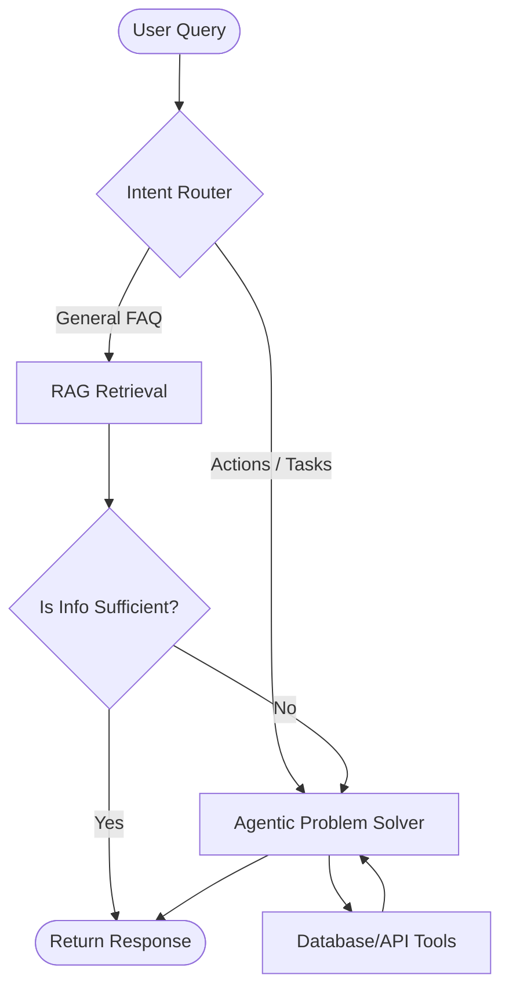

# Architecture: Local Agentic RAG System

This document defines the high-level architecture for the local customer support system, ensuring a balance between efficiency (RAG) and intelligence (Agents).

## 1. The Search-Verify-Act Loop
The system operates on a hierarchical fallback model to minimize latency and token costs while maximizing resolution capacity.

1.  **Intent Router**: Classifies the query immediately into `INFORMATIONAL` (FAQ) or `TRANSACTIONAL` (Action).
2.  **RAG Layer**: If informational, performs a vector search against local document stores.
3.  **Handoff Verifier**: An LLM-based check to verify if the RAG result actually answers the query.
4.  **Agentic Layer**: If a query is transactional or a RAG lookup fails, the query is handed off to a ReAct agent with tool access.

## 2. Component Interaction

## 3. Local Constraints
*   **LLM**: The system MUST run on local models (e.g., Llama 3.1) via local inference engines (Ollama/vLLM).
*   **Vector Store**: Must be a local persistent store (e.g., ChromaDB/FAISS) to ensure data privacy and zero latency over the open web.
*   **Database**: Direct read-only access to `db/mvp.db` for the agentic layer.
