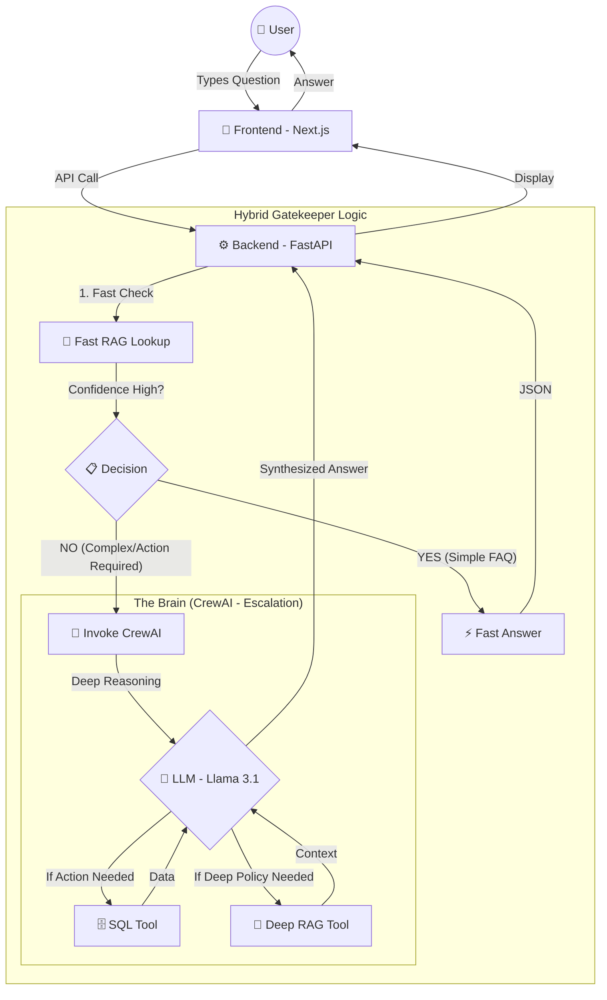

# System Query Flow Map (Hybrid Gatekeeper)

This document visualizes the journey of a user query through the **Hybrid Gatekeeper** architecture. This design prioritizes speed by checking the RAG knowledge base before escalating to the multi-agent CrewAI layer.

## 🗺️ Architectural Flow

---

## 🚀 Step-by-Step Breakdown

### 1. The Interaction Layer (Frontend)
The user interacts with the Next.js `ChatWidget`.

### 2. The Gatekeeper (Tier 1: Fast RAG)
Instead of starting the full agent team immediately, the backend first performs a **Fast RAG Lookup** against `faq.json`. 
- **Goal**: Resolve simple questions (e.g., "What are your hours?") in milliseconds.
- **Decision**: If the LLM identifies the question is a direct FAQ match, it returns the answer immediately.

### 3. The Escalation (Tier 2: CrewAI)
If the query is complex, mentions specific data (orders, prices), or the RAG check is insufficient, the system "escalates" to the **Support Crew**.
- **Agentic reasoning**: The agents decide which SQL tools to use to fetch personal data from `mvp.db`.

### 4. Synthesis & Final Response
The system delivers either a **Fast Answer** (from Tier 1) or a **Synthesized Answer** (from Tier 2), ensuring the user gets the best combination of speed and accuracy.
