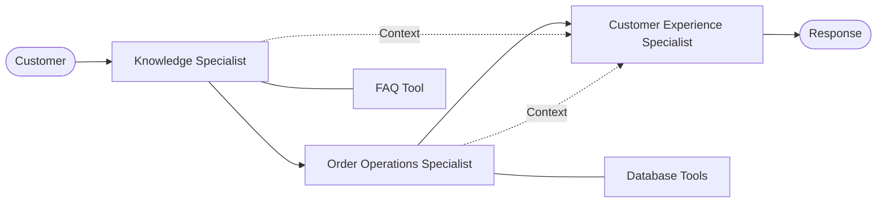

# AI Support System: Multi-Agent Architecture

This directory documents the specialized agents that power the Luxe AI Customer Support system. The system currently uses a **Sequential Process** orchestrated by CrewAI.

## Architecture Overview

The system follows a sequential pipeline where data flows through specialized specialists before being synthesized into a final response.

## Agent Directory

| Agent | Role | Focus |
| :--- | :--- | :--- |
| [Knowledge Specialist](./company_policy_specialist.md) | Policy Expert | FAQ & Knowledge Base |
| [Order Operations Specialist](./order_operations_specialist.md) | Logistics | Tracking & Cancellations |
| [Customer Experience Specialist](./customer_experience_specialist.md) | Final Voice | Synthesis & Tone |

## Strategic Documents

*   **[Project Review (2026-04-25)](./project_review.md)**: A detailed assessment of current architecture, scalability bottlenecks, and production roadmap.

## Design Principles

1. **Specialization**: Each agent has a narrow focus and a specific set of tools to minimize context window noise and improve accuracy.
2. **Sequential Flow**: Information is gathered by specialized agents and passed as context to the final response agent to ensure a single, consistent answer.
3. **Natural Synthesis**: The final agent is responsible for turning raw tool outputs and internal reasoning into professional, friendly customer communication.
4. **Tool-Gated Knowledge**: Specialists are instructed to never guess and always rely on their specific tools (e.g., the Knowledge Specialist must use the FAQ tool).
