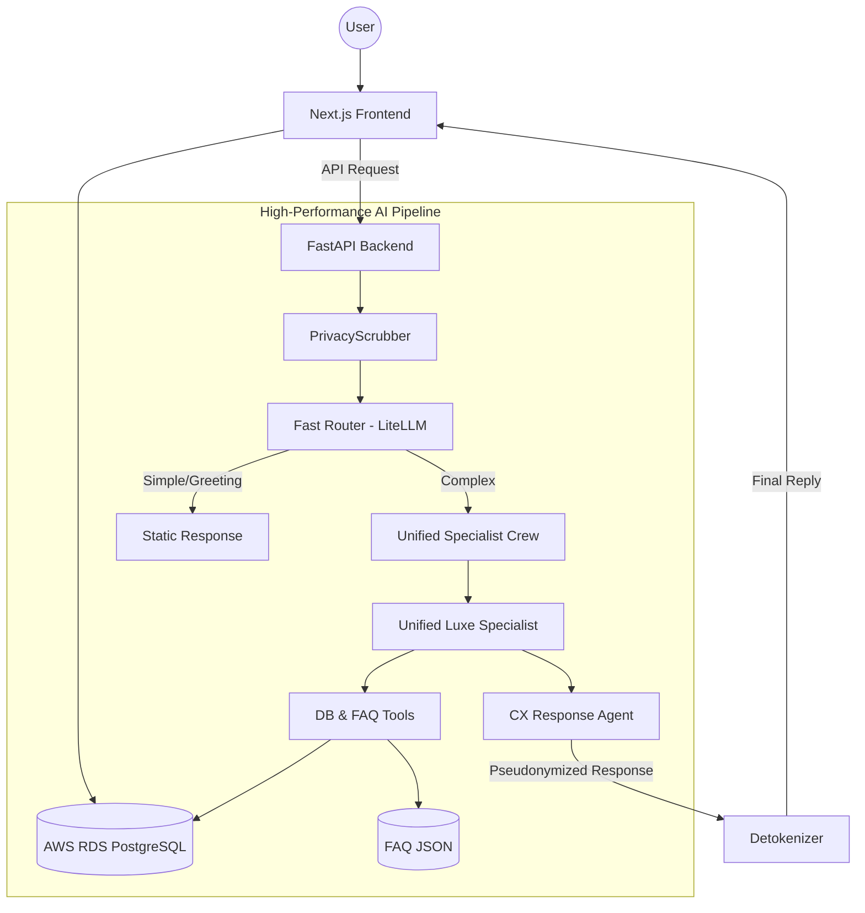

# Luxe E-Commerce & AI Customer Support Assistant

<p align="center">
  
  
  
  
  
  
</p>

A premium, modern e-commerce platform integrated with an advanced, multi-agent AI customer support system. This project demonstrates a production-grade architecture combining a **Next.js 15** frontend with a **FastAPI + CrewAI** backend, backed by a cloud-ready **AWS RDS PostgreSQL** database.

---

## 🌟 Project Overview

This application provides a seamless luxury shopping experience where users can browse products, manage orders, and get intelligent support from an AI agent team that actually *acts* on the database (placing orders, canceling them, searching products) and provides factual answers from a company knowledge base.

### 🏗 Architecture

The project is split into two specialized components sharing a production-grade cloud database, optimized for **sub-5-second** AI response times:



- **Frontend (`/frontend`)**: A high-end web app built with Next.js, React, Prisma, and fully modernized using **Shadcn UI** components. Features a refined checkout flow with interactive AI-driven cards.
- **Backend (`/backend`)**: An optimized agentic AI server powered by CrewAI and FastAPI. Uses robust regex-based signal extraction for seamless UI integration.
- **Performance**: Response times reduced by ~70% using **LiteLLM Fast-Routing** and a **Unified Specialist** agent strategy.
- **Security & GDPR**: Features a robust **PrivacyScrubber** that pseudonymizes data (Names, Emails, Phones, Addresses) before it reaches any LLM. Includes an automated 30-day chat history purge.
- **Infrastructure**: Powered by **AWS RDS PostgreSQL** with secure SSL connectivity. Now includes **Docker** support for streamlined deployment.

---

## ✨ Key Enhancements

### ⚡ Onboarding Quick Replies & "New Chat" (UX Upgrade)
Eliminated the "blank page syndrome" with interactive onboarding flows inspired by competitor benchmarks like **Gigantti.fi**:
- **Onboarding Quick Replies Grid**: Upon launching the chat modal, users are immediately greeted with four interactive, glassmorphic cards: *Track Order*, *Browse Products*, *Cancel Order*, and *File Complaint*. These buttons trigger instant payloads (`handleSend`), skipping the slow LLM generation loop entirely.
- **Auto-Hiding Interface**: The quick reply grid naturally disappears as soon as the user inputs their own custom message (`!messages.some(m => m.role === 'user')`), keeping the chat space clean and focused.
- **"New Chat" Reset Button**: Added a **`+` (Plus)** button to the chat header. Clicking it instantly clears messages, resets the conversation state, and forces the quick reply cards to slide back into view with smooth **Framer Motion** animations.
- **Competitor Benchmarking**: Includes a detailed UX case study and implementation roadmap of top Finnish retailer chatbots under [gigantti_chatbot_features.md](file:///Users/alial-taweel/projects/ai/ai_customer_support_v3/docs/gigantti_chatbot_features.md).

### 🎨 Modernized Storefront with Shadcn UI
The storefront has been fully modernized and overhauled with **Shadcn UI** components to achieve a premium, high-fidelity experience:
- **Consistent Design Language**: Migration from basic HTML controls to unified Shadcn components such as `Button`, `Input`, `Dialog`, `Sheet`, `Tabs`, `Badge`, `Separator`, and `Textarea`.
- **Enhanced Views**: Beautifully integrated Shadcn controls throughout the Shop page, Cart sheet, Orders tracking portal, landing page newsletter forms, and the Admin Complaint dashboard.

### 📍 Active Order Tracking (including PENDING)
The AI support assistant now provides dynamic, visual order tracking updates for orders at all stages:
- **Dynamic Milestones & Maps**: Generates active mock UPS tracking details (carrier, tracking number, estimated delivery, origin, destination, current coordinates, and custom milestones) for all active orders, including `PENDING` and `PROCESSING` states.
- **Seamless Frontend Maps**: Live tracking details are injected using structured `TRACKING_INFO` payloads, allowing the frontend to render interactive maps and shipping progress bars directly inside the customer chat interface.

### 🔌 Seamless HTTPS & API Proxying
- **Mixed Content Solutions**: Client-side API requests are dynamically proxied via Next.js rewrites to the `/api/v1` backend, resolving cross-origin and Mixed Content issues under production HTTPS.
- **Clerk Custom Proxy Domains**: Disabled strict JWT issuer verification on the FastAPI backend to reliably authenticate sessions originating from custom Clerk proxy domains on AWS Amplify deployments.
- **Nginx Reverse Proxy & SSL via DuckDNS**: Implemented Nginx on the EC2 backend instance acting as a reverse proxy, fully secured with a free SSL/TLS certificate using Certbot (Let's Encrypt) and a custom DuckDNS domain (`https://ali-support.duckdns.org`), completely resolving the unencrypted HTTP IP disclosure.

---

## 🚀 Quick Start

### 1. Prerequisites
- **Node.js** (v18+) & **npm**
- **Python** (3.12+)
- **Docker** (Optional, for containerized deployment)
- **AWS RDS PostgreSQL** Instance (or local Postgres)
- **Google Gemini API Key**

### 2. Database & Frontend Setup
```bash
cd frontend
npm install
# Update .env with your DATABASE_URL (PostgreSQL) and Clerk keys
npx prisma generate
npx prisma db push
npm run dev
```
The frontend will be available at [http://localhost:3000](http://localhost:3000).

### 3. AI Backend Setup
```bash
cd backend
python -m venv venv_v3
source venv_v3/bin/activate  # On Windows: venv_v3\Scripts\activate
pip install -r requirements.txt
# Update .env with your DATABASE_URL and GOOGLE_API_KEY
python run.py
```
The backend will run on [http://localhost:3001](http://localhost:3001).

### 4. Production Deployment (AWS EC2)
You can deploy the backend to AWS EC2 using the optimized Docker configuration:
```bash
docker-compose up --build -d
```
For detailed instructions, see the [Deployment Guide](file:///Users/alial-taweel/.gemini/antigravity/brain/de1f030b-9e87-4dfc-8410-11bf630548e7/deployment_guide.md).

---

## 🛠 Tech Stack

| Component | Technology |
| :--- | :--- |
| **Frontend** | Next.js 15 (App Router), React, TypeScript, Tailwind CSS, Shadcn UI, Clerk Auth |
| **Backend** | FastAPI, CrewAI, LangChain, Gemini 1.5 Flash, LiteLLM |
| **LLMs** | Google Gemini (Primary), Ollama (Local Backup/Specialists) |
| **Database** | AWS RDS PostgreSQL, Prisma (Frontend), SQLAlchemy (Backend) |
| **Deployment** | Docker (Multi-stage, Gunicorn), AWS EC2 / RDS |

---

*For detailed technical documentation, please refer to the README files in the respective `/frontend` and `/backend` directories.*
