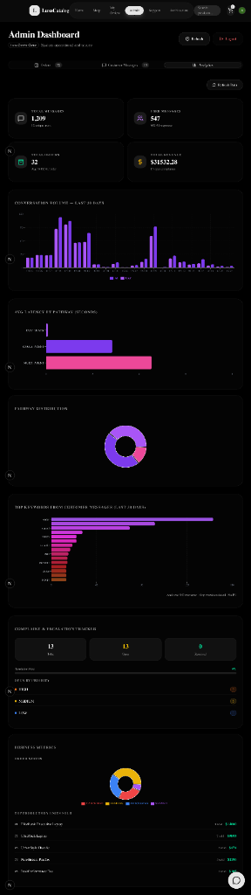
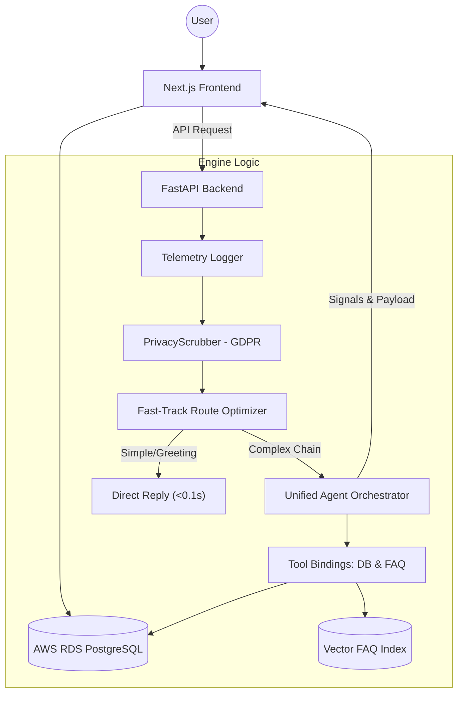

# Enterprise Autonomous AI Orchestration & Evaluation Pipeline

<p align="center">
  
  
  
  
  
  
</p>

> [!IMPORTANT]
> **Architecture Focus:** This repository contains a production-grade autonomous AI agent pipeline. It utilizes enterprise safety controls (PrivacyScrubber), real-time observability telemetry, and features a robust python-native Evaluation Suite to benchmark performance, routing accuracy, and cost. The accompanying E-commerce interface serves merely as the client integration layer.

---

## 🔬 Automated Evaluation & Observability

To guarantee production reliability and mitigate hallucination regressions, this pipeline features an automated benchmarking engine and real-time observability tracking.

### 1. Regression Evaluation Suite (`/backend/evals/`)
The system tracks safety, speed, and routing validity across adversarial inputs. Current snapshot results running against the Gemini architecture:

```text
🚀 INITIALIZING AI AGENT BENCHMARK SUITE
Running Regression Tests:
[1/4] Testing Latency Greeting (FastTrack)... PASSED (0.06s)
[2/4] Testing PII Scrubbing Validation...    PASSED (2.63s)
[3/4] Testing Order Discovery Routing...      PASSED (0.27s)
[4/4] Testing Product Search Trigger...      PASSED (4.94s)

╔════════════════════════════════════════════════╗
║          AI PIPELINE PERFORMANCE REPORT         ║
╚════════════════════════════════════════════════╝
 📊 Overall Success Rate: 100.0% (4/4 Tests Passed)
 ⚡ Avg Response Latency: 1.98s
```

### 2. Real-Time Observability Telemetry
Every user request flows through an observability layer emitting structured JSON metrics into standard I/O or log collectors for cost control and bottleneck identification.
```json
INFO: AI_OBSERVABILITY_METRICS: {
  "user_id": "eval_user_001", 
  "latency_sec": 1.98, 
  "tokens_total": 842, 
  "tool_calls": 1, 
  "signals": ["TRACKING_INFO"], 
  "status": "SUCCESS"
}
```

---

## 📊 Admin Analytics Dashboard

To monitor pipeline metrics in real-time, the platform includes a secure, GDPR-compliant Analytics console in the Admin panel. This console aggregates telemetry, conversation volume, customer complaints, and business intelligence directly from the database.

<p align="center">
  
</p>

---

## 🏛️ System Architecture

The engine splits decision loops between heuristic-optimized routes and deep agentic chains sharing a cloud-native database. 



---

## ⚡ Core Architectural Components

### 🛡️ GDPR Privacy Scrubber (Interceptor Layer)
Sensitive data governance is enforced before runtime calls. A robust middleware interceptor parses user input for names, physical addresses, and contact details, replacing them with reversible pseudonymization tokens. This ensures zero external leaking of user identity to SaaS LLM endpoints.

### 🧭 Intent Routing & Heuristic Bypass
To shave user latency down by over 70%, inputs pass through a pre-LLM heuristic evaluator. Common operations (greetings, status checks) trigger specialized shortcuts return in milliseconds, preserving GPU compute and minimizing API costs.

### 🤖 Native Multi-Tool Agent (Google AI SDK)
Complex inquiries trigger the Autonomous Orchestrator. The orchestrator decodes natural language intents into functional database calls—autonomously verifying product stock, processing order updates, and scraping internal policy documentation instantly.

---

## 🏢 B2B SaaS Multi-Tenancy & Distribution Blueprint

To demonstrate architectural maturity for enterprise software environments, this platform has been designed with a clear, production-ready path to B2B SaaS Multi-Tenancy. Below is the technical transition blueprint currently being integrated:

1. **Logical Data Isolation (Multi-Tenancy):**
   * **Relational DB (PostgreSQL):** An `organizations` table binds all primary business assets (`products`, `orders`, `chats`, `complaints`) using an `organization_id` foreign key. Fast-routing middleware injects Row-Level Security (RLS) policies at the PostgreSQL database level.
   * **Vector Search Isolation (RAG):** Document chunk vectorization and conversational retrievals are strictly isolated utilizing collection namespaces (`org_{organization_id}`) within the Vector DB layer, guaranteeing absolute tenant data isolation.
2. **Secure Embeddable Client Widget:**
   * **Iframe Sandbox Architecture:** The client-facing widget is loaded via a secure, sandboxed `<iframe>` wrapper injected onto client websites. This prevents global DOM namespace collisions, JS injection vulnerabilities, and style leakage from client sites.
   * **Domain Guarding:** An origin-verification middleware checks the incoming request's HTTP `Origin` or `Referer` headers against the tenant's registered domains in Postgres before initiating conversational websocket sessions.
3. **Self-Serve Admin & Telemetry Management:**
   * **Tenant Console:** A dedicated administrative portal allowing client companies to custom-configure their AI's brand identity, tune system prompts, rotate API keys, and upload local domain context files.
   * **Token Metering & Billing:** Stripe Webhook integrations monitor real-time token usage and message counts, dynamically throttling API access according to tenant subscription tiers.

---

## 🚀 Quick Start

### 1. Prerequisites
- **Node.js** (v18+) & **Python** (3.12+)
- **AWS RDS PostgreSQL** Instance (or local Postgres)
- **Google Gemini API Key**

### 2. Run AI Evaluation Suite (Local Benchmarking)
```bash
cd backend
./venv_v3/bin/python evals/eval_agent.py
```

### 3. Launch Application Backend & Client
**Start Backend Server (FastAPI):**
```bash
cd backend
source venv_v3/bin/activate
python run.py
```

**Start Client Interface (Next.js):**
```bash
cd frontend
npm install
npx prisma generate && npx prisma db push
npm run dev
```

---

## 🛠 Tech Stack Breakdown

| Component | Technology |
| :--- | :--- |
| **AI Pipeline & Evaluators** | Python-native Regression Framework, Observability JSON Logging |
| **Agentic Orchestration** | Google AI SDK (Native Function Calling), FastAPI |
| **LLMs** | Google Gemini Flash, LiteLLM (Evaluation) |
| **Security & Compliance** | Regex-Token Pseudonymization Layer (GDPR ready) |
| **Data Platform & RAG** | AWS RDS PostgreSQL, LangChain, FAISS Vector Index |
| **Frontend Interface** | Next.js 16, TypeScript, Shadcn UI, Framer Motion |
| **Ops & Infrastructure** | Docker & Docker-Compose, Nginx SSL Proxying, AWS EC2 |

---
