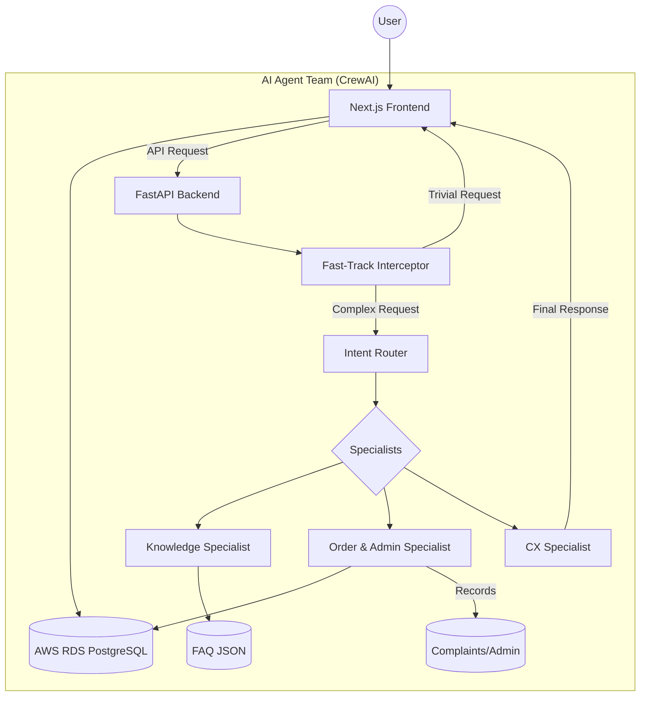

# Luxe E-Commerce & AI Customer Support Assistant

A premium, modern e-commerce platform integrated with an advanced, multi-agent AI customer support system. This project demonstrates a production-grade architecture combining a **Next.js** frontend with a **FastAPI + CrewAI** backend, backed by a cloud-ready **AWS RDS PostgreSQL** database.

## 🌟 Project Overview

This application provides a seamless luxury shopping experience where users can browse products, manage orders, and get intelligent support from an AI agent team that actually *acts* on the database (placing orders, canceling them, searching products) and provides factual answers from a company knowledge base.

### 🏗 Architecture

The project is split into two specialized components sharing a production-grade cloud database:



- **Frontend (`/frontend`)**: A high-end web app built with Next.js, React, and Prisma.
- **Backend (`/backend`)**: An agentic AI server powered by CrewAI and FastAPI.
- **Security & Privacy**: Features a **PrivacyScrubber** that masks PII before it reaches the LLM and enforces **authenticated tool access** via **Clerk** to prevent data leakage.
- **Infrastructure**: Migrated from local SQLite to a secure **AWS RDS PostgreSQL** instance with SSL connectivity.

---

## 🚀 Quick Start

### 1. Prerequisites
- **Node.js** (v18+) & **npm**
- **Python** (3.12+)
- **AWS RDS PostgreSQL** Instance (or local Postgres)
- **Google Gemini API Key** (for agent reasoning)

### 2. Database & Frontend Setup
```bash
cd frontend
npm install
# Update .env with your DATABASE_URL (PostgreSQL)
npx prisma generate
npx prisma db push
npm run dev
```
The frontend will be available at [http://localhost:3000](http://localhost:3000).

### 3. AI Backend Setup
```bash
cd backend
python -m venv venv_v3
source venv_v3/bin/activate  # On Windows: venv_v3\Scripts\activate
pip install -r requirements.txt
# Update .env with your DATABASE_URL and GOOGLE_API_KEY
python run.py
```
The backend will run on [http://localhost:3001](http://localhost:3001).

---

## 🛠 Tech Stack

| Component | Technology |
| :--- | :--- |
| **Frontend** | Next.js 15, React, TypeScript, Tailwind CSS, Clerk Auth |
| **Backend** | FastAPI, CrewAI, LangChain, Gemini 1.5 Flash |
| **LLMs** | Google Gemini (Primary), Ollama (Local Backup/Specialists) |
| **Database** | AWS RDS PostgreSQL, Prisma (Frontend), SQLAlchemy (Backend) |
| **Search** | FAISS, HuggingFace Embeddings (RAG) |

---

*For detailed technical documentation, please refer to the README files in the respective `/frontend` and `/backend` directories.*
