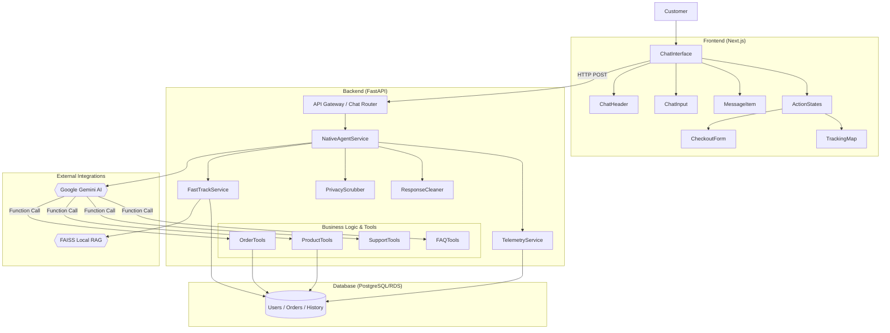
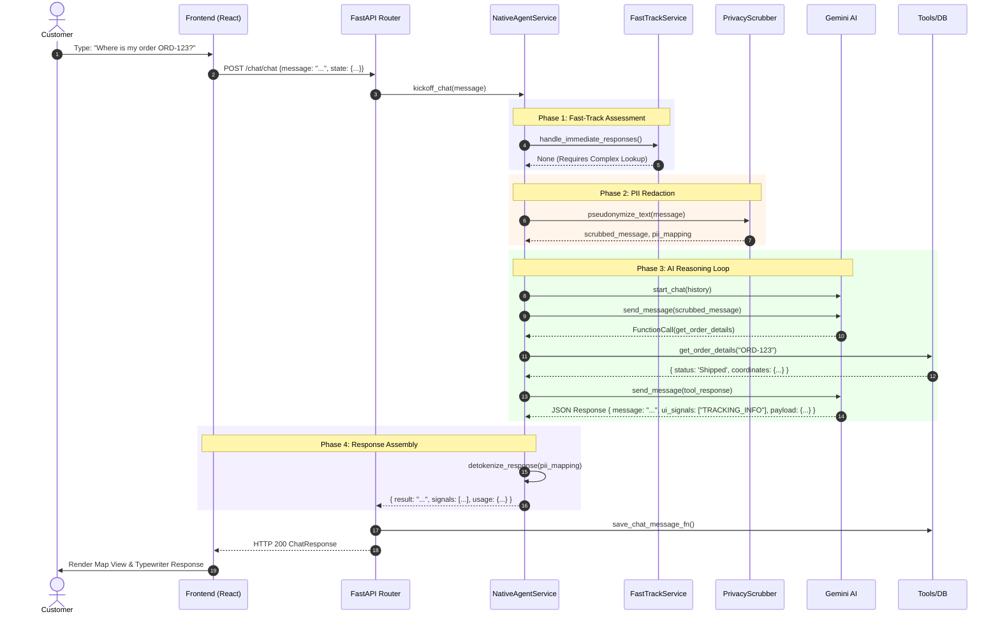
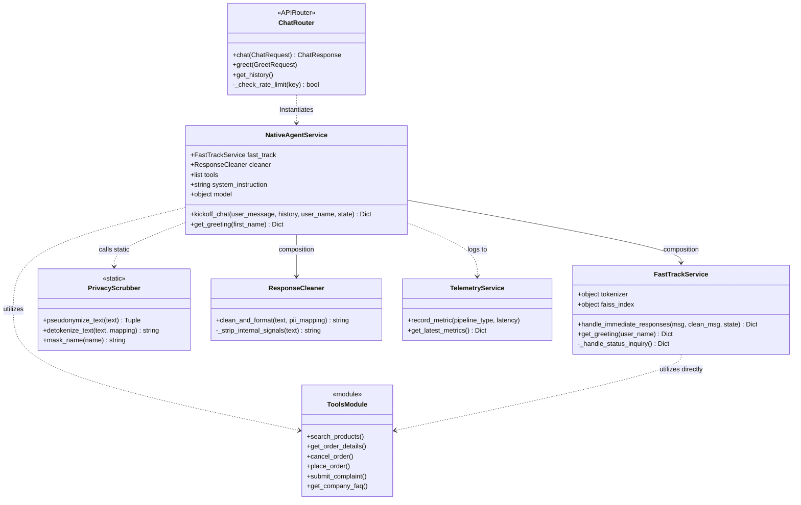

# Luxe AI Customer Support - UML Diagrams

This document provides a comprehensive UML representation of the **Luxe AI Customer Support** project, covering system components, data flows, and class-level structure.

---

## 1. 🧩 Component Diagram

Visualizes the logical organization of system components, their relationships, and dependencies between subsystems.

---

## 2. 🚀 Sequence Diagram: Chat Message Flow

Traces the lifecycle of a customer inquiry as it moves from the frontend widget through the hybrid pipeline and back.

---

## 🏛️ 3. Class Diagram: Backend Core

Details the static relationships, attributes, and methods of the core backend service classes.

---

## 📐 Diagram Annotations & Architectural Shifts

*   **Unified Hybrid Driver**: The architecture emphasizes a hybrid flow where deterministic queries (Fast-Track) bypass the LLM entirely for ~100ms responses, while unstructured queries delegate to `NativeAgentService`.
*   **NativeAgent Migration**: Replaced legacy multi-agent system (CrewAI) with direct Gemini `NativeAgentService` leveraging Native Function Calling, decreasing latency and token bloat.
*   **Telemetry integration**: Seamless capture of latency and successful requests injected from backend to visual observability panels.
