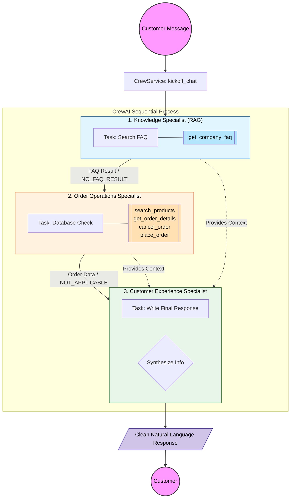

# Luxe AI Customer Support - System Architecture

This document describes the workflow and agentic pipeline of the Luxe AI Customer Support system.

## Workflow Diagram

## System Components

### 1. The Entry Point (`CrewService`)
The `kickoff_chat` function in `backend/app/services/crew_service.py` is the conductor. It takes the user's message and history, then starts the sequential process.

### 2. Knowledge Specialist (RAG Agent)
*   **Role:** Expert on company policies.
*   **Tool:** `get_company_faq` (searches `FAQ/faq.json`).
*   **Job:** Finds the "ground truth" for any general question. If it can't find anything, it returns `NO_FAQ_RESULT`.

### 3. Order Operations Specialist (Transaction Agent)
*   **Role:** Handles all database actions.
*   **Tools:** `search_products`, `get_order_details`, `cancel_order`, `place_order`.
*   **Job:** Executes database changes or searches. If the request is a general question (like "What time do you open?"), it returns `NOT_APPLICABLE`.

### 4. Customer Experience Specialist (Response Agent)
*   **Role:** The final voice of the brand.
*   **Job:** Receives the outputs from the first two agents. It acts as an editor, stripping away internal codes and technical jargon to produce a single, polished, warm response.

## Why Token Usage is High
Because this is a **sequential agentic pipeline**, each request involves:
1.  **Instruction Bloat:** Every agent sends their full backstory and tool definitions to the LLM.
2.  **Chain of Thought:** Each agent "thinks" internally before taking an action.
3.  **Context Chaining:** Agent 3 has to read the outputs of Agent 1 and Agent 2, increasing the input size for the final step.
