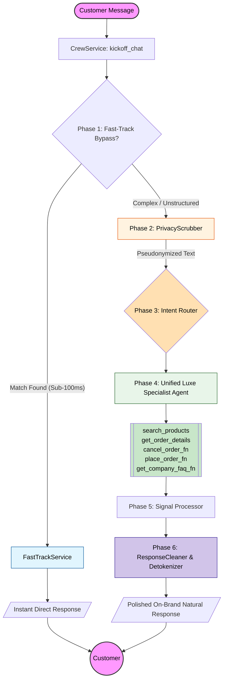

# Luxe AI Customer Support - System Architecture

This document describes the modern, optimized hybrid workflow and agentic pipeline of the Luxe AI Customer Support system.

## 🔄 Modern Hybrid Workflow Diagram

The system combines a sub-100ms **Fast-Track bypass pipeline** for predictable, structured queries with a fallback **Unified CrewAI Agentic Pipeline** to handle complex, multi-step customer intents.

---

## 🛠️ Core System Components

### 1. The Entry Point (`CrewService`)
The [CrewService](file:///Users/alial-taweel/projects/ai/ai_customer_support_v3/backend/app/services/crew_service.py#L16) acts as the central conductor. When a message is received, it executes the routing logic:
1.  **Fast-Track Assessment**: Immediately runs regex, direct RAG FAQ indexes, or pending order confirmation hooks via [FastTrackService](file:///Users/alial-taweel/projects/ai/ai_customer_support_v3/backend/app/services/fast_track_service.py#L7) to check if the LLM can be bypassed.
2.  **PII Pseudonymization**: Sanitizes input using [PrivacyScrubber](file:///Users/alial-taweel/projects/ai/ai_customer_support_v3/backend/app/core/privacy.py#L31) to strip sensitive details (names, emails, phones, addresses) before external network calls.
3.  **Unified Specialist Execution**: Invokes a single-agent CrewAI environment for complex reasoning.

### 2. Fast-Track Pipeline (`FastTrackService`)
To minimize token costs and ensure instant response latency (<100ms):
*   **Greetings & Follow-ups**: Handled statically.
*   **Direct Order Lookup & Tracking**: Fetches active status and injects live tracking coordinates directly from database queries.
*   **Local RAG FAQ Engine**: Employs local HuggingFace embeddings and a **FAISS vector index** to answer common company policies instantly.

### 3. Unified Luxe Specialist Agent (CrewAI)
Unlike legacy implementations that split operations across three separate sequential agents (Knowledge, Order, and Response Specialists), we now use a single **Unified Luxe Specialist**:
*   **Role**: Expert transactional assistant with full tooling access (`get_company_faq`, `search_products`, `order_management`, etc.).
*   **Goal**: Executes actions and gathers necessary data in a single pass, eliminating sequential agent handoff latency and instruction token bloat.

### 4. Signal Processor (`SignalProcessor`)
Translates machine-readable states returned by agents (such as `PRODUCT_LIST: [...]`, `CHECKOUT_REQUIRED`, or `TRACKING_INFO: { ... }`) into clean JSON payloads. This lets the frontend chat widget render dynamic progress bars, shipping maps, and product carousels seamlessly.

### 5. Response Cleaner & Detokenizer (`ResponseCleaner`)
Extracts final natural language answers, strips internal agent instructions or symbols, and detokenizes PII tags back into original values so the customer receives a personalized response.

---

## 💡 Why this Hybrid Pipeline is Superior to Legacy Multi-Agent Designs

1.  **Eliminated Agent-Handoff Latency**: The legacy 3-agent pipeline required sequentially sending inputs through three separate LLM reasoning cycles. Our hybrid pipeline resolves simple questions in **sub-100ms** and complex ones with only **one LLM cycle**.
2.  **Reduced Token Bloat**: Legacies repeated backstories and system instructions across three different agents. The Unified Agent layout cuts prompt size by more than **50%**.
3.  **Strict GDPR Security**: Real-time pseudonymization secures customer data before any third-party AI processing.
